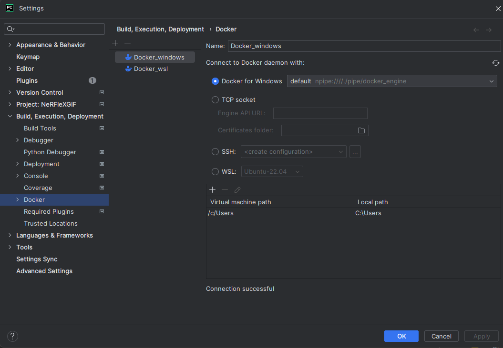
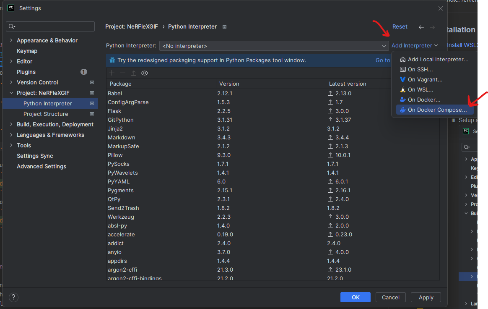
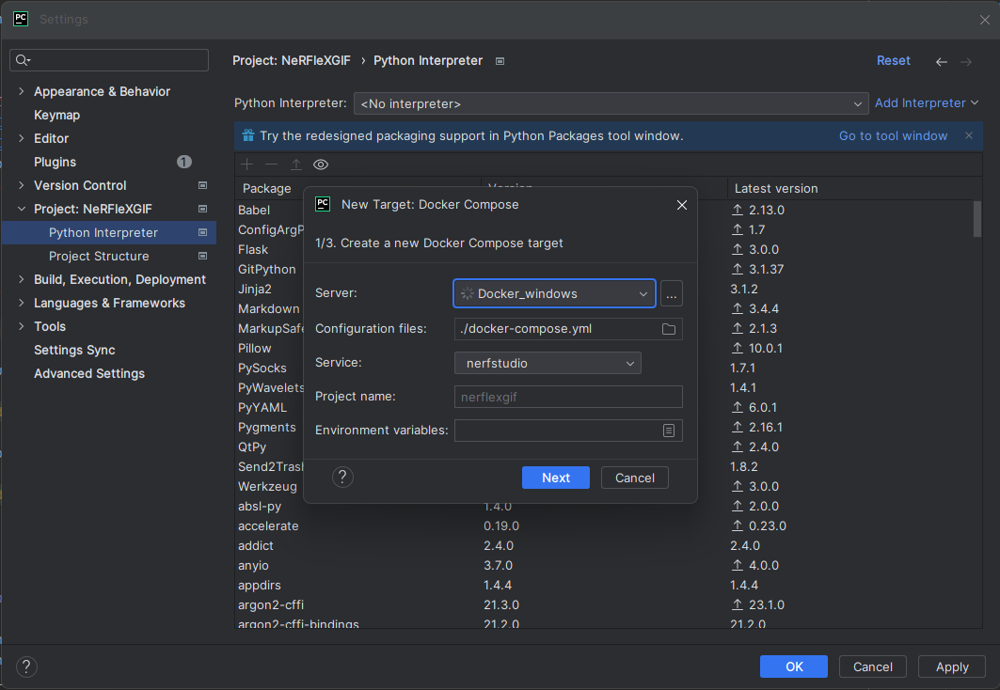
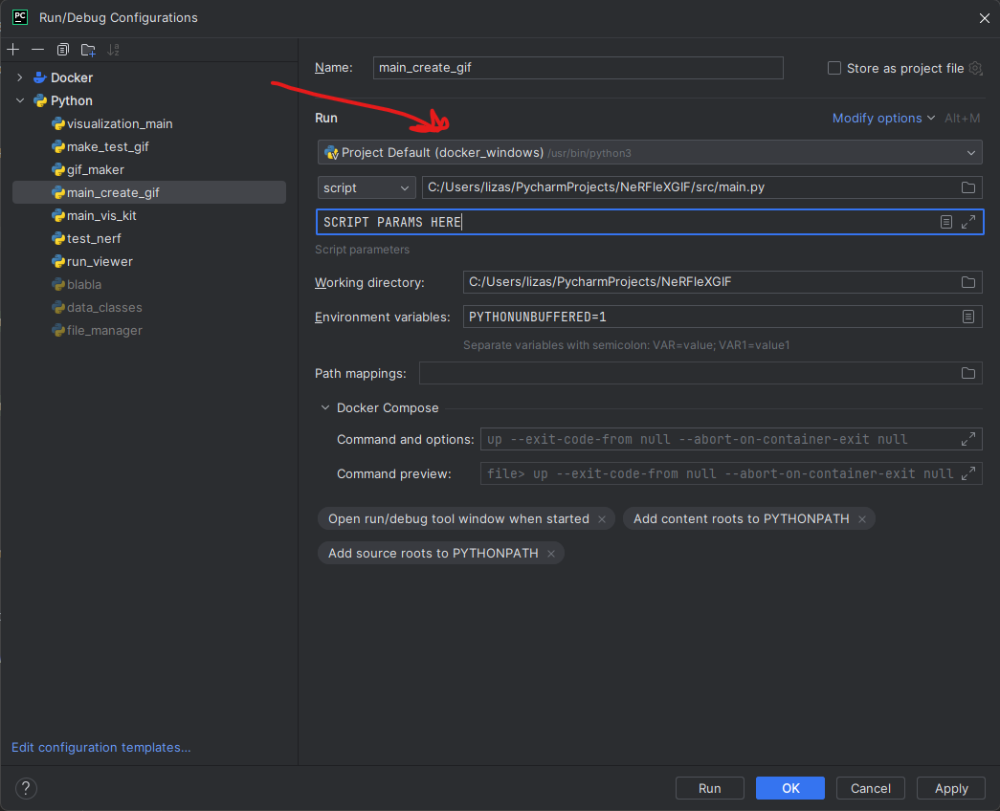

# continual_train_nerf
detecting & implementing new object

Avishai Oz & Nir Segal - Moderator: Simon Korman

We wrote a script in nerfstudio for detecting a new object in the scene and implementing the new object in the 3D model, the NeRF network.
___

## Installation process:

1. [Install WSL2 with Ubuntu 22.04](https://linuxconfig.org/ubuntu-22-04-on-wsl-windows-subsystem-for-linux)
2. [Install Docker Desktop](https://docs.docker.com/desktop/install/windows-install/)
3. For debugging:
    1. Edit the provided [env file](.env):
        1. Edit CUDA_ARCHITECTURES to fit for compute capability, e.g. for RTX 30x0 series, CUDA_ARCHITECTURES=86.
    2. Inside [docker-compose.yaml](docker-compose.yml):
        1. Edit mounted volumes under 'volumes:' so that it matches the absolute path mapping from the host machine to
           the
           container (do not edit the container part).
    3. Setup a listener on the docker socket:
        1. 
        2. Connection successful should appear when connected, otherwise, try troubleshooting your docker desktop
           software.
    4. Create a remote interpreter based on the docker-compose.yml:
        1. 
        2. Keep pressing next:
           
        3. Verify that your python script's run configuration has the docker interpreter:
           

4. Run from cmd line:
    ```bash
    docker run --gpus all -v [absolute project path]:/workspace/ -v[absolute project path].cache:/home/user/.cache/ -p 7007:7007 --rm -it --ipc=host dromni/nerfstudio:0.3.2 "python main.py [ARGS]"
    ```
   For help:
    ```bash
    docker run --gpus all -v [absolute project path]:/workspace/ -v [absolute project path].cache:/home/user/.cache/ -p 7007:7007 --rm -it --ipc=host dromni/nerfstudio:0.3.2 "python main.py --help"
    ```
